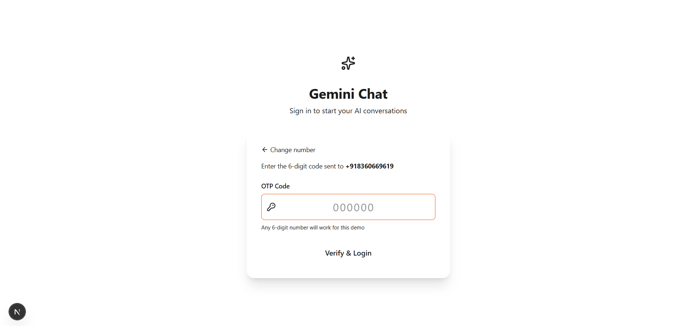
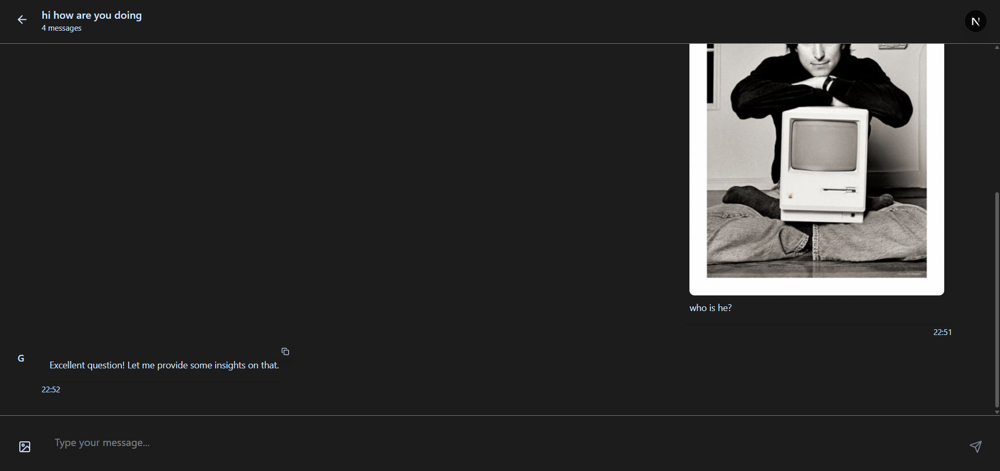

# Gemini Frontend Clone 

This is a fully functional, responsive, and visually appealing frontend clone of a Gemini-style conversational AI chat application. The project was built as a frontend assignment to demonstrate practical knowledge of Next.js, component-based architecture, client-side state management, and modern UI/UX features.

The application is frontend-only and simulates backend interactions (like OTP validation and AI responses) using browser-based tools.

**[Live Demo](gemini-eesh-kuvata.vercel.app)**
**[Video Demo](https://www.loom.com/share/7ad8d14711284604abe4353919ef6489?sid=19b14d94-7882-436e-a0d5-6d5ac36dfa67)**
**[UI Images](https://drive.google.com/drive/folders/1569LXU5NJrPYpBpgds6u8A9qkSYNu1q7?usp=sharing)**


# Sample credentials - 

**Number**  : 9876543210
**Opt** : 000000

---

## Screenshots




---

## Features

- **OTP-based Authentication**: Simulated login/signup flow using phone numbers and country codes fetched from a live API.
- **Chatroom Management**: Create, delete, and search chatrooms.
- **Real-time Chat Interface**:
  - User and simulated AI messages with timestamps.
  - "Gemini is typing..." indicator.
  - Throttled AI responses to mimic thinking.
  - Image upload previews.
  - Copy-to-clipboard for messages.
- **Infinite Scroll & Pagination**: Reverse infinite scroll to load older messages in batches.
- **Global UX**:
  - Fully Responsive Design for mobile and desktop.
  - Light/Dark Mode Toggle with theme persistence.
  - Toast notifications for user feedback.

---

## Tech Stack

- **Framework**: Next.js 15 (App Router)
- **Language**: TypeScript
- **Styling**: Tailwind CSS
- **State Management**: Zustand
- **Form Validation**: React Hook Form + Zod
- **UI Libraries**: Lucide React (for icons), React Hot Toast (for notifications)
- **Theming**: `next-themes`

---

## Setup and Run Locally

To get a local copy up and running, follow these simple steps.

1.  **Clone the repository:**
    ```sh
    git clone [https://github.com/eeshm/gemini](https://github.com/eeshm/gemini)
    ```
2.  **Navigate to the project directory:**
    ```sh
    cd your-repo-name
    ```
3.  **Install dependencies:**
    ```sh
    npm install
    ```
4.  **Run the development server:**
    ```sh
    npm run dev
    ```
    Open [http://localhost:3000](http://localhost:3000) with your browser to see the result.

---

## Folder Structure

The project follows a feature-driven structure to keep the code organized and scalable.

```
/
├── app/
│   ├── (auth)/             # Authentication routes (Login, OTP)
│   ├── (dashboard)/        # Protected routes after login
│   │   ├── dashboard/
│   │   │   ├── chat/[id]/  # Dynamic route for individual chatrooms
│   │   │   └── page.tsx    # Main dashboard layout
│   │   └── layout.tsx      # Auth guard for dashboard routes
│   ├── components/         # Reusable React components (Sidebar, ChatMessage, etc.)
│   ├── globals.css         # Global styles and Tailwind CSS theme variables
│   └── layout.tsx          # Root layout with ThemeProvider
├── lib/
│   └── schemas.ts          # Zod schemas for form validation
└── store/
    ├── authStore.ts        # Zustand store for authentication state
    └── chatStore.ts        # Zustand store for chatrooms and messages
```

---

## Implementation Details

Here’s how some of the key features were implemented:

### Form Validation

Form validation is handled using a combination of **React Hook Form** for managing form state and **Zod** for schema validation.

- **Schemas**: In `lib/schemas.ts`, strict schemas like `phoneSchema` and `otpSchema` are defined. These schemas specify data types, required fields, and validation rules (e.g., minimum length).
- **Resolver**: The `zodResolver` is used to connect Zod schemas with React Hook Form. This provides real-time, type-safe validation with minimal boilerplate, automatically displaying error messages next to the invalid fields.

### Throttling AI Responses

To create a more realistic user experience, AI responses are throttled to simulate "thinking" time.

- In the `ChatInterface` component's `handleSendMessage` function, a `setTimeout` is wrapped in a `Promise`.
- The delay is randomized (`2000 + Math.random() * 1000`) to feel more natural.
- The "Gemini is typing..." indicator is shown during this delay and hidden once the simulated response is ready, providing clear visual feedback to the user.

### Reverse Infinite Scroll & Pagination

Reverse infinite scroll is implemented to efficiently load the message history without fetching all messages at once.

- **State Management**: The `ChatInterface` component maintains a local state `displayedMessages`, which is a "page" of messages from the global Zustand store.
- **Scroll Detection**: The chat container has an `onScroll` event handler that checks if the user has scrolled to the very top (`scrollTop === 0`).
- **Loading More**: When the top is reached, the `loadMoreMessages` function is triggered. It calculates the next batch of older messages to load from the main array in the Zustand store using `slice()`. These older messages are then prepended to the `displayedMessages` array, and the scroll position is adjusted to prevent it from jumping, creating a seamless infinite scroll experience.